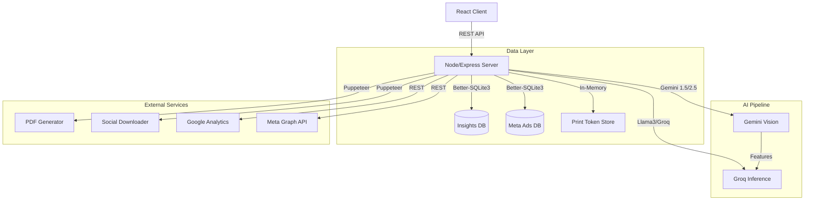

# StrataPilot: Technical Architecture & System Audit

**Date:** January 30, 2026
**To:** CTO / Engineering Leadership
**Context:** Full System Audit & Documentation

---

## 1. System Architecture Overview

StrataPilot is a **Node.js/Express** monolith serving a **React (Vite)** frontend. It leverages a **Hybrid AI Pipeline** to process multi-media inputs and generate strategic consulting outputs.

### High-Level Topology (Mermaid)

---

## 2. Core Subsystems & Data Flow

### A. Ingestion & Analysis Pipeline (`analyzeCollateralSmart`)
1.  **Ingest:** Receives Video URL or File Upload.
2.  **Download:** `SocialDownloader` (in `socialDownloader.ts`) uses Puppeteer to extract video binaries.
    *   *Hack:* Uses `/embed/captioned` for Instagram to bypass login walls.
    *   *Risk:* High latency, high CPU, flaky availability.
3.  **Vision Analysis:** Uploads media to Gemini File API. Extracts visual features (pacing, emotions, objects).
4.  **Strategy Generation:**
    *   **Legacy Mode:** Gemini handles both vision and text.
    *   **Hybrid Mode:** Visual features are passed to Groq (Llama 3) for faster, cheaper strategic inference.
5.  **Persist:** Results stored in `insights.db` (SQLite) with a generated `contentHash`.

### B. Persistence Layer (`insightDb.ts`)
*   **Database:** `better-sqlite3` (Sync I/O).
*   **Schema:** `insights` table with JSON columns for flexible schema (`analysis`, `tags`).
*   **Concurrency:** Currently runs in default mode (Blocking). **Missing WAL mode**.
*   **Edit Workflow:**
    *   Frontend edits trigger `PUT /api/insights/:id` (Debounced).
    *   Server performs JSON merge patch on the `analysis` column.
    *   Client uses `auditId` (DB Primary Key) injected during the initial `POST /api/analyze` response.

### C. PDF Export Pipeline (`pdfService.ts`, `PrintView.tsx`)
1.  **Snapshot:** Client sends current state (including unsaved edits) to `POST /api/reports/print`.
2.  **Tokenization:** Server stores state in `PrintTokenStore` (In-memory LRU) and returns a one-time token.
3.  **Headless Render:** Puppeteer launches, navigates to `/print/:token`.
4.  **Rehydration:** The page fetches the snapshot using the token.
5.  **Rendering:** `PrintView.tsx` renders a dedicated, simplified DOM for print (no animations, enforced page breaks).
6.  **Capture:** Puppeteer generates PDF buffer and streams to client.

---

## 3. Production Risks & Scalability Limits

### 🔴 Critical Blockers (Must Fix Before Scale)
1.  **Filesystem Dependency:**
    *   The app writes critical data (`insights.db`) and temp files (`os.tmpdir()`) to local disk.
    *   **Implication:** Cannot deploy to stateless serverless (Vercel, Lambda, Cloud Run) without mounting persistent volumes.
    *   **Recommendation:** Migrate DB to PostgreSQL (Supabase/RDS) and temp files to S3.

2.  **Puppeteer Resource Intensity:**
    *   Both `SocialDownloader` and `PDFService` launch Chrome instances.
    *   **Implication:** 1 concurrent request = ~500MB-1GB RAM. A traffic spike of 10 users could crash a standard container.
    *   **Recommendation:** Offload Puppeteer to a dedicated microservice or use a service like Browserless.io.

### 🟡 Security & Stability
1.  **Missing Headers:** No `helmet` or `rate-limit` middleware. Vulnerable to basic attacks.
2.  **SQLite Locking:** `better-sqlite3` is synchronous. Heavy write load (e.g., bulk ingestion) will block the Node event loop. Enable WAL mode or switch to Postgres.

---

## 4. Dependencies & Licensing
*   **`@distube/ytdl-core`**: Unofficial YouTube scraper. subject to "Cat and Mouse" breakage.
*   **`better-sqlite3`**: Requires native build toolchain (`python`, `make`, `g++`) on the deployment image.

## 5. Deployment Checklist
*   [ ] **Env Vars:** keys for Gemini, Groq, Meta, GA4.
*   [ ] **Storage:** Persistent volume mounted at `./data`.
*   [ ] **Memory:** Min 2GB+ allocation.
*   [ ] **Build:** run `npm install` inside the final container environment.

---
**Verdict:** The system is architecturally sound for a high-value, low-volume tool (Consultancy use case). For high-volume SaaS scaling, the **Storage** and **Puppeteer** layers require decoupling.
