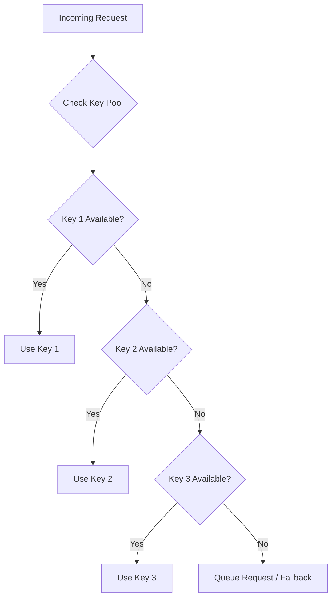
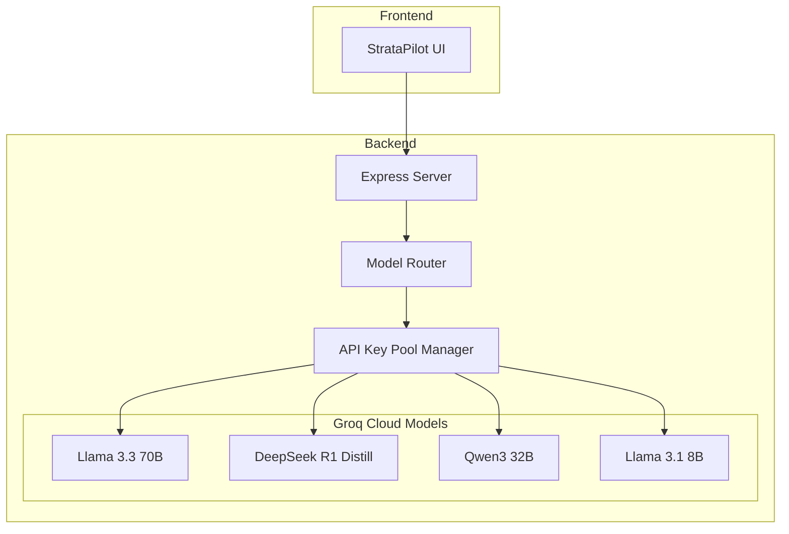
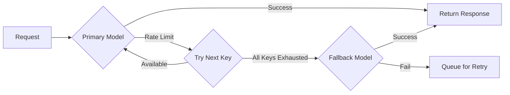
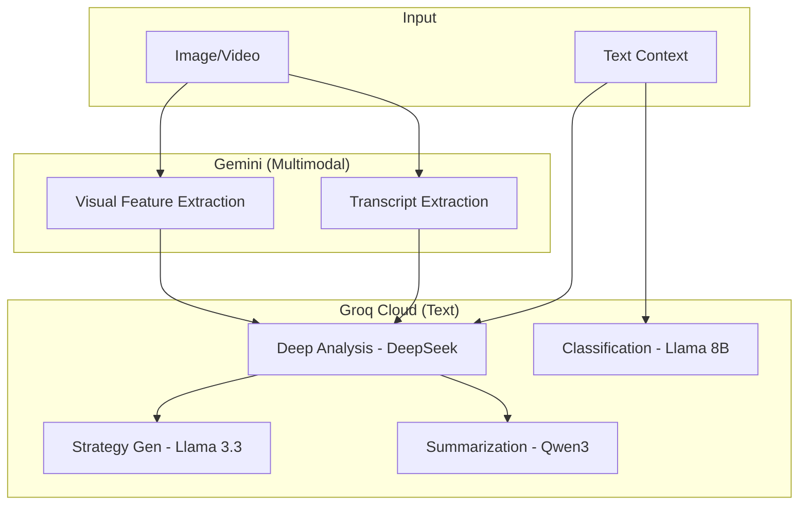

# Multi-LLM Strategy Research: Groq Cloud Open-Source Models

> **Research Date:** January 20, 2026  
> **Objective:** Build a model-agnostic AI layer using free/open-source models via Groq Cloud

---

## Executive Summary

This research explores building a **Multi-LLM routing architecture** using Groq Cloud's free tier to leverage multiple open-source models. The goal: **best brain for the job at the lowest cost possible** while avoiding vendor lock-in.

> [!IMPORTANT]
> Groq Cloud offers **generous free tier limits** with access to state-of-the-art open-source models, making it an ideal platform for cost-effective multi-model orchestration.

---

## Critical Corrections (Senior Review Incorporated)

> [!CAUTION]
> The initial research has been updated based on production-level review. These corrections are **non-optional**.

### 1. Pre-Router Classifier Required en
**Problem:** Static routing assumes task type and complexity are known upfront—false in practice.

**Fix:** Stage 0 uses `llama-3.1-8b-instant` to classify intent + complexity before routing. This alone cuts DeepSeek usage by 40–60%.

### 2. DeepSeek Role Correction
**Correct usage:** Diagnostic scoring, framework compliance, structured gap analysis, numerical evaluation.

**Incorrect usage:** Emotional resonance, brand voice, creative narratives—these belong to Llama 3.3.

### 3. Two-Pass Reasoning Pattern
For high-stakes outputs:
1. **Draft pass:** Llama 3.3 generates narrative/strategy
2. **Critique pass:** DeepSeek validates logic, flags gaps, scores rigor

### 4. Gemini as Compiler, Not Analyst
Gemini should ONLY:
- Extract objects, scenes, emotions, pacing, text, transcript
- Output strict structured JSON

Never let Gemini generate strategic conclusions—that stays in Groq.

### 5. Cost Governor Layer
Before routing, compute estimated tokens + model cost class + remaining daily budget. Reject or downgrade proactively. **No silent throttling.**

### 6. Evaluation & Drift Control Required
Store per-task: `model_id`, `prompt_hash`, `output_hash`. Enable periodic regression checks. Without this, "best brain for the job" is belief, not measurement.

### 7. API Key Rotation Risk
Multi-key free tier rotation may violate ToS. Treat as experimental. Build so keys are interchangeable with paid keys. Log per-key usage aggressively.

---

## Part 1: Available Models on Groq Cloud (January 2026)

### Current Model Catalog

| Model ID | Parameters | Context Window | Best For | Free Tier Limit |
|----------|------------|----------------|----------|-----------------|
| `llama-3.3-70b-versatile` | 70B | 128K tokens | General-purpose, multilingual, creative | ~14,400 req/day |
| `llama-3.1-8b-instant` | 8B | 128K tokens | Fast responses, simple tasks | ~14,400 req/day |
| `deepseek-r1-distill-llama-70b` | 70B | 64K tokens | Complex reasoning, math, coding | ~1,000 req/day |
| `deepseek-r1-distill-qwen-32b` | 32B | 64K tokens | Reasoning (smaller, faster) | ~1,000 req/day |
| `qwen/qwen3-32b` | 32B | 32K tokens | Analysis, summarization, creative | ~1,000 req/day |
| `gemma2-9b-it` | 9B | 8K tokens | Lightweight tasks, fast inference | ~14,400 req/day |
| `mistral-saba-24b` | 24B | 32K tokens | Efficient general purpose | ~14,400 req/day |

### Model Deprecation Timeline

> [!WARNING]
> - `deepseek-r1-distill-llama-70b` deprecated **October 2, 2025** → Use `llama-3.3-70b-versatile` or `openai/gpt-oss-120b`
> - `qwen-qwq-32b` deprecated **July 14, 2025** → Use `qwen/qwen3-32b`

---

## Part 2: Free Tier Rate Limits Strategy

### Managing Multiple API Keys

Using **2-3 Groq API keys** can effectively triple your capacity:

```
Single Key Limits:
├── Llama models: ~14,400 requests/day (10 req/min)
├── DeepSeek models: ~1,000 requests/day
├── Qwen models: ~1,000 requests/day (60 req/min)
└── General: 6,000 tokens/minute

With 3 Keys:
├── Llama models: ~43,200 requests/day
├── DeepSeek models: ~3,000 requests/day
└── Qwen models: ~3,000 requests/day
```

### Rate Limit Strategy



---

## Part 3: Model-Task Optimal Matching

### Task Categories for StrataPilot

Based on your current codebase analysis, here are the task types:

| Task Category | Description | Current Handler |
|--------------|-------------|-----------------|
| **Creative Analysis** | Ad diagnostics, visual hierarchy, emotional mapping | `analyzeCollateral()` |
| **Audience Profiling** | Demographics, psychographics, behavioral analysis | Same Gemini call |
| **Strategy Generation** | Campaign pillars, messaging, channel selection | `generateCampaignStrategy()` |
| **Industry Classification** | Auto-detect industry from content | Inline in analysis |
| **Summarization** | Competitive context, insight compression | `CompetitiveContextGenerator` |

### Recommended Model Routing Matrix

| Task Type | Primary Model | Fallback Model | Rationale |
|-----------|---------------|----------------|-----------|
| **Deep Analysis** | `deepseek-r1-distill-llama-70b` | `llama-3.3-70b-versatile` | DeepSeek excels at structured reasoning |
| **Summarization** | `qwen/qwen3-32b` | `llama-3.1-8b-instant` | Qwen's enhanced long-context understanding |
| **Creative/Ideation** | `llama-3.3-70b-versatile` | `qwen/qwen3-32b` | Llama 3.3 leads in creative alignment |
| **Quick Classification** | `llama-3.1-8b-instant` | `gemma2-9b-it` | Speed-optimized for simple tasks |
| **Complex Reasoning** | `deepseek-r1-distill-qwen-32b` | `deepseek-r1-distill-llama-70b` | Chain-of-thought capabilities |

### Model Strengths Deep-Dive

#### Llama 3.3 70B Versatile
- **MMLU Score:** 86.0 (general knowledge)
- **HumanEval:** 88.4 (code generation)
- **MGSM:** 91.1 (multilingual reasoning)
- **Best for:** Creative writing, multilingual content, general-purpose analysis
- **128K context:** Ideal for long-form ad analysis with competitive context

#### DeepSeek R1 Distill Models
- **AIME 2024:** 79.8% (advanced math)
- **MATH-500:** 97.3%
- **Architecture:** Reinforcement learning powered
- **Best for:** Structured analysis, diagnostic scoring, numerical reasoning

#### Qwen3 32B
- **Context:** 256K tokens (enhanced version)
- **Specialty:** Dual-mode (thinking/non-thinking)
- **Best for:** Summarization, long document comprehension, analysis

---

## Part 4: Proposed Routing Architecture

### Architecture Diagram



### Router Decision Logic

```typescript
interface RouterConfig {
  task: 'analysis' | 'summarization' | 'ideation' | 'classification' | 'reasoning';
  complexity: 'low' | 'medium' | 'high';
  inputTokens: number;
  priority: 'speed' | 'quality' | 'cost';
}

function selectModel(config: RouterConfig): ModelSelection {
  // Deep analysis tasks → DeepSeek for structured reasoning
  if (config.task === 'analysis' && config.complexity === 'high') {
    return { 
      primary: 'deepseek-r1-distill-llama-70b',
      fallback: 'llama-3.3-70b-versatile'
    };
  }
  
  // Summarization → Qwen for long-context excellence
  if (config.task === 'summarization') {
    return {
      primary: 'qwen/qwen3-32b',
      fallback: 'llama-3.1-8b-instant'
    };
  }
  
  // Creative/ideation → Llama 3.3 for human preference alignment
  if (config.task === 'ideation') {
    return {
      primary: 'llama-3.3-70b-versatile',
      fallback: 'qwen/qwen3-32b'
    };
  }
  
  // Quick tasks → Fast lightweight models
  if (config.priority === 'speed' || config.complexity === 'low') {
    return {
      primary: 'llama-3.1-8b-instant',
      fallback: 'gemma2-9b-it'
    };
  }
  
  // Default fallback
  return { primary: 'llama-3.3-70b-versatile', fallback: 'llama-3.1-8b-instant' };
}
```

---

## Part 5: Implementation Recommendations

### Phase 1: Core Infrastructure

1. **Create `services/llmRouter/` module:**
   - `keyPoolManager.ts` - Manage multiple API keys with rate limit tracking
   - `modelRouter.ts` - Task-to-model routing logic
   - `groqClient.ts` - OpenAI-compatible Groq API client
   - `types.ts` - TypeScript interfaces

2. **Key Pool Manager Design:**
   ```
   GROQ_API_KEY_1=gsk_...
   GROQ_API_KEY_2=gsk_...
   GROQ_API_KEY_3=gsk_...
   ```

3. **Unified API Interface:**
   - All Groq models use OpenAI-compatible API
   - Single client with model parameter switching
   - Automatic retry with key rotation on rate limits

### Phase 2: Task Decomposition

Split current monolithic Gemini calls into specialized subtasks:

| Current Function | Split Into | Assigned Model |
|-----------------|------------|----------------|
| `analyzeCollateral()` | `extractVisualFeatures()` | Llama 3.3 70B |
| | `generateDiagnostics()` | DeepSeek R1 |
| | `classifyIndustry()` | Llama 3.1 8B |
| `generateCampaignStrategy()` | `synthesizeStrategy()` | Llama 3.3 70B |
| Competitive context | `summarizePatterns()` | Qwen3 32B |

### Phase 3: Fallback & Resilience



---

## Part 6: Cost Analysis

### Current State (Gemini)
- Gemini 2.0 Flash: Free tier available but limited
- Single vendor dependency

### Proposed State (Groq Multi-Model)

| Scenario | Daily Capacity | Models Used | Cost |
|----------|---------------|-------------|------|
| Single Key | ~15,400 requests | All | **FREE** |
| 3 Keys | ~46,200 requests | All | **FREE** |
| Overflow (paid) | Unlimited | All | ~$0.05-0.99/M tokens |

> [!TIP]
> By using 3 Groq API keys with intelligent routing, you can handle **~46,000 requests/day completely free**, far exceeding typical application needs.

---

## Part 7: Key Trade-offs & Risks

### Advantages
1. **Zero cost** for substantial usage
2. **Vendor independence** - not locked to Google
3. **Task optimization** - right model for each job
4. **Blazing speed** - Groq's LPU hardware (~500 tokens/sec)

### Risks & Mitigations

| Risk | Impact | Mitigation |
|------|--------|------------|
| Rate limit hits | Request failures | Key rotation + queuing |
| Model deprecation | Breaking changes | Abstract model IDs, monitor announcements |
| Quality variance | Inconsistent output | Extensive prompt engineering per model |
| No vision support | Can't analyze images/videos | Keep Gemini for multimodal tasks |

> [!CAUTION]
> **Critical Limitation:** Groq's open-source models do **not support image/video input**. For your creative analysis use case that processes ad images and videos, you'll still need Gemini or another multimodal provider for the visual understanding step.

---

## Part 8: Recommended Hybrid Architecture

Given StrataPilot's heavy reliance on image/video analysis, here's a hybrid approach:



### Task Distribution

| Task | Provider | Model | Rationale |
|------|----------|-------|-----------|
| Image/Video Understanding | Gemini | gemini-2.0-flash | Only viable option for vision |
| Visual Feature Description | Gemini | gemini-2.0-flash | Extract as structured text |
| Deep Diagnostic Analysis | Groq | deepseek-r1-distill-70b | Superior reasoning |
| Strategy Synthesis | Groq | llama-3.3-70b | Creative excellence |
| Insight Summarization | Groq | qwen3-32b | Long-context compression |
| Industry Classification | Groq | llama-3.1-8b | Fast, accurate |

---

## Next Steps

1. **Validate this architecture** with your team
2. **Create implementation plan** for the LLM router module
3. **Set up Groq Cloud accounts** and generate 2-3 API keys
4. **Start with text-only tasks** (strategy generation, summarization)
5. **Gradually migrate** analysis components where feasible

---

## References

- [Groq Cloud Documentation](https://console.groq.com/docs)
- [Groq Pricing & Models](https://groq.com/pricing)
- [Llama 3.3 Announcement](https://ai.meta.com/blog/llama-3-3/)
- [DeepSeek R1 Technical Report](https://deepseek.com)
- [Qwen3 Release Notes](https://qwenlm.github.io)
