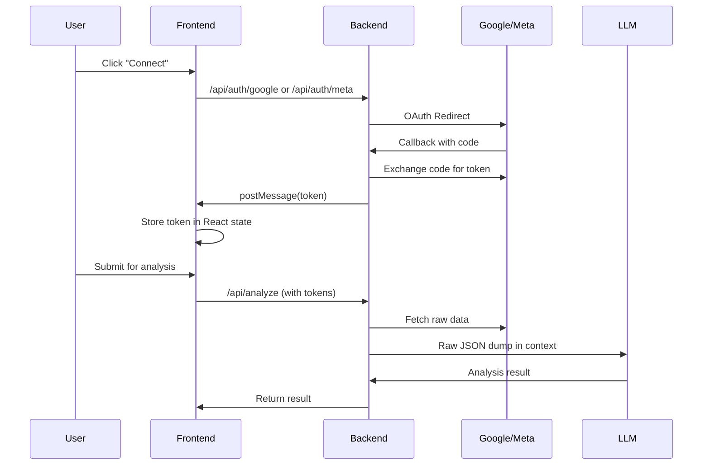

# GA4 & Meta Ads Integration Audit Report

**Date:** 2026-01-21  
**Status:** Audit Complete  
**Auditor:** StrataPilot AI Integration Team

---

## Executive Summary

This audit examined the existing GA4 (Google Analytics 4) and Meta Ads integration in the StrataPilot codebase. **Significant integration work already exists**, including complete OAuth flows, token exchange, data fetching services, and LLM context injection. However, **critical gaps remain** that prevent the integration from meeting production requirements.

---

## What Already Exists ✓

### GA4 Integration

| Component | Status | File Location | Notes |
|-----------|--------|---------------|-------|
| OAuth URL Generator | ✓ Complete | [googleAnalytics.ts](file:///Users/pranamyajain/stratapilot/server/services/googleAnalytics.ts#L13-L23) | Uses `googleapis` SDK, correct scopes |
| Token Exchange | ✓ Complete | [googleAnalytics.ts](file:///Users/pranamyajain/stratapilot/server/services/googleAnalytics.ts#L25-L28) | `getGoogleTokens()` function |
| Data Fetching | ✓ Complete | [googleAnalytics.ts](file:///Users/pranamyajain/stratapilot/server/services/googleAnalytics.ts#L30-L91) | Fetches 5 metrics over 28 days |
| Backend Routes | ✓ Complete | [server.ts](file:///Users/pranamyajain/stratapilot/server/server.ts#L1226-L1252) | `/api/auth/google` and callback |
| LLM Context Injection | ✓ Complete | [server.ts](file:///Users/pranamyajain/stratapilot/server/server.ts#L1136-L1144) | Appends to analysis context |

**Scopes Configured:**
- `https://www.googleapis.com/auth/analytics.readonly`
- `https://www.googleapis.com/auth/userinfo.email`

**Metrics Currently Fetched:**
- `activeUsers`, `screenPageViews`, `sessions`, `bounceRate`, `engagementRate`

---

### Meta Ads Integration

| Component | Status | File Location | Notes |
|-----------|--------|---------------|-------|
| OAuth URL Generator | ✓ Complete | [metaAds.ts](file:///Users/pranamyajain/stratapilot/server/services/metaAds.ts#L7-L10) | Facebook Graph API v18.0 |
| Token Exchange | ✓ Complete | [metaAds.ts](file:///Users/pranamyajain/stratapilot/server/services/metaAds.ts#L12-L27) | `getMetaTokens()` function |
| Data Fetching | ✓ Complete | [metaAds.ts](file:///Users/pranamyajain/stratapilot/server/services/metaAds.ts#L29-L68) | Account-level insights, 30 days |
| Backend Routes | ✓ Complete | [server.ts](file:///Users/pranamyajain/stratapilot/server/server.ts#L1254-L1280) | `/api/auth/meta` and callback |
| LLM Context Injection | ✓ Complete | [server.ts](file:///Users/pranamyajain/stratapilot/server/server.ts#L1147-L1155) | Appends to analysis context |

**Permissions Configured:**
- `ads_read`, `read_insights`

**Metrics Currently Fetched:**
- `spend`, `impressions`, `clicks`, `cpc`, `cpm`, `ctr`, `actions`

---

### Frontend Integration

| Component | Status | File Location |
|-----------|--------|---------------|
| Connection Modal | ✓ Complete | [ConnectionModal.tsx](file:///Users/pranamyajain/stratapilot/components/ConnectionModal.tsx) |
| OAuth Popup Flow | ✓ Complete | Uses `window.open()` with `postMessage` |
| Token State Management | ✓ Complete | [Dashboard.tsx](file:///Users/pranamyajain/stratapilot/pages/Dashboard.tsx#L25-L27) |
| Property ID Input | ✓ Complete | GA4 modal prompts for property ID |

---

## Current Data Flow



---

## Critical Gaps Identified ✗

### 1. Raw Data Dumps to LLM

**Problem:** GA4 and Meta data is passed as raw JSON to the LLM context.

```typescript
// Current implementation (server.ts:1139-1140)
const gaData = await fetchGA4Data(googleToken, gaPropertyId);
externalDataContext += `\n\nREAL-WORLD PERFORMANCE DATA (Google Analytics 4):\n${JSON.stringify(gaData, null, 2)}`;
```

**Issue:** This violates the "insight-first, privacy-aware design" requirement. Raw data can be verbose, include irrelevant details, and consume unnecessary tokens.

---

### 2. Session-Only Token Storage

**Problem:** Tokens are stored only in frontend React state.

```typescript
// Dashboard.tsx:25-27
const [googleToken, setGoogleToken] = useState<string | null>(null);
const [metaToken, setMetaToken] = useState<string | null>(null);
```

**Issues:**
- Tokens lost on page refresh
- No refresh token handling for Google (long sessions)
- Tokens passed through frontend to backend on each request

---

### 3. No Insight Extraction Layer

**Problem:** No intermediate processing layer transforms raw API data into strategic insights.

**What's needed:**
- GA4: Traffic source analysis, campaign performance trends, audience segmentation insights
- Meta: Creative performance patterns, CTR/CPA benchmarks, audience breakdown summaries

---

### 4. Missing Environment Variables

**Required but not verified as configured:**
- `GOOGLE_CLIENT_ID`
- `GOOGLE_CLIENT_SECRET`
- `META_APP_ID`
- `META_APP_SECRET`

---

### 5. No Graceful Fallback

**Problem:** When accounts are not connected, no explicit indicator appears in the LLM context about what data is missing.

---

## Audit Answers

| Question | Answer |
|----------|--------|
| Is OAuth already wired for GA4? | ✓ Yes, complete flow |
| Is OAuth already wired for Meta? | ✓ Yes, complete flow |
| Are tokens stored securely server-side? | ✗ No, frontend state only |
| Are any APIs already fetching data? | ✓ Yes, both GA4 and Meta |
| Is data already passed to LLM context? | ✓ Yes, but as raw JSON dumps |

---

## Files Referenced

| File | Purpose | Lines |
|------|---------|-------|
| [googleAnalytics.ts](file:///Users/pranamyajain/stratapilot/server/services/googleAnalytics.ts) | GA4 OAuth + data fetching | 92 |
| [metaAds.ts](file:///Users/pranamyajain/stratapilot/server/services/metaAds.ts) | Meta OAuth + data fetching | 69 |
| [ConnectionModal.tsx](file:///Users/pranamyajain/stratapilot/components/ConnectionModal.tsx) | Frontend OAuth UI | 148 |
| [Dashboard.tsx](file:///Users/pranamyajain/stratapilot/pages/Dashboard.tsx) | Token state management | 576 |
| [server.ts](file:///Users/pranamyajain/stratapilot/server/server.ts) | OAuth routes + LLM integration | 1323 |

---

## Conclusion

The GA4 and Meta Ads integration is **~70% complete**. The foundational OAuth flows, API clients, and context injection exist. What remains is:

1. **Insight extraction layer** to convert raw data → strategic signals
2. **Secure token storage** (optional for MVP, critical for production)
3. **Defensive handling** when data sources are unavailable

The next phase will produce a detailed implementation plan for these remaining items.
