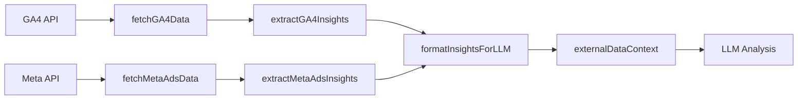

# GA4 & Meta Ads Integration Plan

## Goal Description

Transform raw GA4/Meta API data into **structured insights** suitable for LLM context injection, ensuring privacy-aware, insight-first design. The focus is on extracting actionable patterns rather than dumping raw metrics.

---

## Current State

The following already exists and **will be reused**:
- OAuth flows for both GA4 and Meta (fully functional)
- Token exchange mechanisms
- Data fetching functions (`fetchGA4Data`, `fetchMetaAdsData`)
- Frontend connection modals
- LLM context injection points in `server.ts`

---

## Proposed Changes

### Component 1: Insight Extraction Services

#### [NEW] [insightExtractors.ts](file:///Users/pranamyajain/stratapilot/server/services/insightExtractors.ts)

A new service module that transforms raw API data into strategic insights.

**GA4 Insight Extraction:**
- Identify traffic trends (up/down/stable)
- Calculate engagement quality signals
- Highlight conversion rate vs bounce rate relationship
- Provide audience activity patterns

**Meta Ads Insight Extraction:**
- Calculate cost efficiency (CPC, CPM trends)
- Determine CTR performance vs industry benchmarks
- Summarize ROAS indicators
- Flag underperforming metrics

**Output Format:**
```typescript
interface ExtractedInsights {
  source: 'GA4' | 'MetaAds';
  period: string;
  keyFindings: string[];      // 3-5 bullet points
  performanceSignal: 'strong' | 'moderate' | 'weak' | 'unknown';
  anomalies: string[];        // Unusual patterns
  recommendations: string[];  // 2-3 actionable items
}
```

---

### Component 2: Server Integration Updates

#### [MODIFY] [server.ts](file:///Users/pranamyajain/stratapilot/server/server.ts)

**Changes at lines ~1070-1156:**

Replace raw JSON dumps with insight extraction calls:

```diff
- externalDataContext += `\n\nREAL-WORLD PERFORMANCE DATA (Google Analytics 4):\n${JSON.stringify(gaData, null, 2)}`;
+ const gaInsights = extractGA4Insights(gaData);
+ externalDataContext += formatInsightsForLLM(gaInsights);
```

**New helper function:**
```typescript
function formatInsightsForLLM(insights: ExtractedInsights): string {
  // Format as structured text, not raw JSON
  return `\n\n[${insights.source} INSIGHTS - ${insights.period}]\n` +
    `Performance: ${insights.performanceSignal.toUpperCase()}\n` +
    `Key Findings:\n${insights.keyFindings.map(f => `• ${f}`).join('\n')}\n` +
    (insights.anomalies.length ? `Anomalies: ${insights.anomalies.join('; ')}\n` : '') +
    `Suggested Focus: ${insights.recommendations.join(' | ')}`;
}
```

---

### Component 3: Defensive Handling

#### [MODIFY] [server.ts](file:///Users/pranamyajain/stratapilot/server/server.ts)

Add explicit context when data sources are unavailable:

```typescript
// When no tokens provided
if (!googleToken && !metaToken) {
  externalDataContext += `\n\n[DATA CONTEXT: No external data sources connected. Analysis based on visual and textual inputs only.]`;
}
```

---

### Component 4: Type Definitions

#### [NEW] [insightTypes.ts](file:///Users/pranamyajain/stratapilot/server/types/insightTypes.ts)

TypeScript interfaces for insight structures:

```typescript
export interface GA4InsightInput {
  source: string;
  period: string;
  metrics: Array<{ name: string; value: string }>;
}

export interface MetaAdsInsightInput {
  source: string;
  account?: string;
  period: string;
  metrics: Record<string, any>;
}

export interface ExtractedInsights {
  source: 'GA4' | 'MetaAds';
  period: string;
  keyFindings: string[];
  performanceSignal: 'strong' | 'moderate' | 'weak' | 'unknown';
  anomalies: string[];
  recommendations: string[];
}
```

---

## Files to Modify/Create

| Action | File | Description |
|--------|------|-------------|
| **[NEW]** | `server/services/insightExtractors.ts` | Core insight extraction logic |
| **[NEW]** | `server/types/insightTypes.ts` | TypeScript interfaces |
| **[MODIFY]** | `server/server.ts` | Replace raw dumps with insight calls |

---

## What Will NOT Change

- ✗ No UI/UX modifications
- ✗ No changes to OAuth flows (already working)
- ✗ No changes to token handling (session-only is acceptable for MVP)
- ✗ No changes to `googleAnalytics.ts` or `metaAds.ts` (data fetching works)
- ✗ No new API endpoints required

---

## Verification Plan

### Automated Tests

There are no existing unit tests for the GA4/Meta integration services. I will create a simple test for the insight extraction logic.

#### New Test: Insight Extractor Unit Test

**File:** `server/services/__tests__/insightExtractors.test.ts`

**Test cases:**
1. `extractGA4Insights()` returns valid structure from mock GA4 data
2. `extractMetaAdsInsights()` returns valid structure from mock Meta data
3. `formatInsightsForLLM()` produces correctly formatted string
4. Edge case: empty metrics returns 'unknown' performance signal

**Run command:**
```bash
cd /Users/pranamyajain/stratapilot && npm test -- --grep "insightExtractors"
```

> [!NOTE]
> If no test runner is configured, I will verify by checking TypeScript compilation and manual testing.

---

### Manual Verification

#### Test 1: GA4 Integration Flow

1. Start the server: `npm run dev`
2. Open browser to `http://localhost:3000`
3. Connect a GA4 account (requires valid Google OAuth credentials in `.env`)
4. Upload a sample image/video
5. Run analysis
6. **Check server console** for log output containing `[GA4 INSIGHTS]` instead of raw JSON
7. **Verify LLM context** does not contain raw `{"source":"Google Analytics 4","metrics":[...]}` but instead shows formatted insights

#### Test 2: Meta Ads Integration Flow

1. Same as above, but connect Meta Ads account
2. **Check server console** for `[Meta Ads INSIGHTS]` format
3. Verify insights appear in final report context

#### Test 3: Disconnected State

1. Clear all tokens (refresh page)
2. Run analysis without connecting any data sources
3. **Verify** server logs include: `[DATA CONTEXT: No external data sources connected...]`

---

## Data Flow After Implementation



---

## Constraints Verified

| Constraint | Status |
|------------|--------|
| No frontend visual changes | ✓ Compliant |
| No client-side secrets | ✓ Compliant (no changes to token flow) |
| No raw dumps to LLM | ✓ Will be fixed |
| Insight-first design | ✓ New extractor layer |
| Defensive handling | ✓ Explicit disconnected state |

---

## Estimated Changes

- **New code:** ~150 lines
- **Modified code:** ~30 lines in `server.ts`
- **Risk:** Low (additive changes, no breaking modifications)
