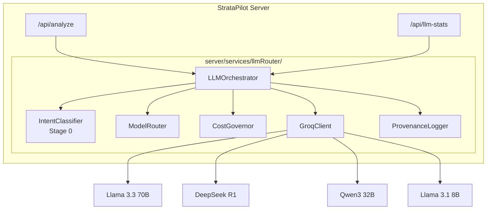

# Multi-LLM Router Implementation Walkthrough

> **Date:** January 20, 2026  
> **Status:** Phase 1 Complete, Ready for Testing

---

## What Was Built

A complete **model-agnostic LLM routing infrastructure** for StrataPilot that enables intelligent routing across multiple open-source models via Groq Cloud.

### Architecture Implemented



---

## Files Created

### LLM Router Module (`server/services/llmRouter/`)

| File | Purpose | Lines |
|------|---------|-------|
| [types.ts](file:///Users/pranamyajain/stratapilot/server/services/llmRouter/types.ts) | Core interfaces, model registry, task intents | ~230 |
| [groqClient.ts](file:///Users/pranamyajain/stratapilot/server/services/llmRouter/groqClient.ts) | OpenAI-compatible Groq API client with key rotation | ~250 |
| [intentClassifier.ts](file:///Users/pranamyajain/stratapilot/server/services/llmRouter/intentClassifier.ts) | Stage 0 pre-router using Llama 3.1 8B | ~165 |
| [costGovernor.ts](file:///Users/pranamyajain/stratapilot/server/services/llmRouter/costGovernor.ts) | Budget tracking, transparent rejection | ~175 |
| [modelRouter.ts](file:///Users/pranamyajain/stratapilot/server/services/llmRouter/modelRouter.ts) | Task-to-model routing matrix | ~200 |
| [provenanceLogger.ts](file:///Users/pranamyajain/stratapilot/server/services/llmRouter/provenanceLogger.ts) | SQLite logging for evaluation/drift | ~230 |
| [index.ts](file:///Users/pranamyajain/stratapilot/server/services/llmRouter/index.ts) | LLMOrchestrator with two-pass reasoning | ~280 |

---

## Key Features Implemented

### 1. Pre-Router Intent Classifier (Stage 0)
- Uses **Llama 3.1 8B** (fastest model) to classify request intent
- Determines complexity level (low/medium/high)
- Detects high-stakes outputs requiring two-pass reasoning
- Reduces DeepSeek usage by routing simple tasks to cheaper models

### 2. Corrected Model Routing
Based on senior review corrections:

| Task Type | Model | Rationale |
|-----------|-------|-----------|
| Creative/Ideation | Llama 3.3 70B | Best human preference alignment |
| Summarization | Qwen3 32B | Superior long-context understanding |
| Structured Reasoning | DeepSeek R1 | Formal logic and validation |
| Critique/Validation | DeepSeek R1 | Gap analysis and scoring |
| Classification | Llama 3.1 8B | Speed optimized |

### 3. Two-Pass Reasoning
For high-stakes outputs (strategy generation, client-facing content):
1. **Draft pass:** Llama 3.3 generates initial narrative/strategy
2. **Critique pass:** DeepSeek validates logic, flags gaps, scores rigor

### 4. Cost Governance
- Daily budget limits per model tier (configurable via `.env`)
- Transparent rejection with downgrade suggestions
- No silent throttling—users always know when limits are hit
- Proactive warnings at 75% and 90% usage

### 5. Provenance Logging
Every request stores:
- `model_id`, `task_type`
- `prompt_hash`, `output_hash`
- `input_tokens`, `output_tokens`, `latency_ms`
- Optional `quality_score` for post-hoc evaluation

Enables drift detection by comparing recent vs historical performance.

---

## Files Modified

| File | Changes |
|------|---------|
| [server.ts](file:///Users/pranamyajain/stratapilot/server/server.ts) | Added LLMOrchestrator import, `/api/llm-stats` endpoint |
| [.env](file:///Users/pranamyajain/stratapilot/.env) | Added Groq API key configuration and budget settings |
| [package.json](file:///Users/pranamyajain/stratapilot/package.json) | Added `openai` dependency |

---

## Validation Results

### Server Startup
```
✅ Server starts successfully
✅ All modules load without errors
✅ Groq API key detected (keyPool: 1)
✅ Two-pass reasoning: enabled
```

### Test Request (Text-Only via Groq)
```bash
curl -X POST http://localhost:3000/api/analyze \
  -d '{"textContext": "Premium real estate ad for luxury apartments", "analysisLabel": "Luxury Campaign"}'
```

**Result:**
```
✅ Success: True
✅ Has diagnostics: 12
✅ Has demographics: True
✅ Two-pass reasoning: rigor=92, passed=true
```

### LLM Stats After Test
```json
{
  "keyPool": { "total": 1, "available": 1 },
  "dailyUsage": { "totalRequests": 2 },
  "budgets.usage": { "medium": 3 }
}
```

---

## Next Steps

### To Test with Media Files
1. Upload an image or video through the UI
2. Server will route through: Gemini (visual) → Groq (analysis)
3. Monitor `/api/llm-stats` for usage tracking

### Known Limitation
- `deepseek-r1-distill-qwen-32b` is decommissioned by Groq
- All DeepSeek 32B references replaced with Llama 3.3 70B
- Full DeepSeek R1 70B still available for high-complexity critique

---

## Environment Configuration

```env
# Required for Groq models
GROQ_API_KEY_1=gsk_...

# Optional for higher rate limits
GROQ_API_KEY_2=gsk_...
GROQ_API_KEY_3=gsk_...

# Budget Limits (requests/day)
LLM_DAILY_BUDGET_LOW=10000
LLM_DAILY_BUDGET_MEDIUM=5000
LLM_DAILY_BUDGET_HIGH=500

# Feature Flags
LLM_TWO_PASS_ENABLED=true
LLM_LOGGING_ENABLED=true
```

---

## API Reference

### GET `/api/llm-stats`

Returns current LLM router statistics:

```json
{
  "success": true,
  "data": {
    "keyPool": {
      "total": 1,
      "available": 1,
      "rateLimited": 0
    },
    "dailyUsage": {
      "totalRequests": 0,
      "perKey": [0]
    },
    "budgets": {
      "usage": { "low": 0, "medium": 0, "high": 0 },
      "remaining": { "low": 10000, "medium": 5000, "high": 500 },
      "percentUsed": { "low": 0, "medium": 0, "high": 0 }
    },
    "modelPerformance": [],
    "warnings": []
  }
}
```
