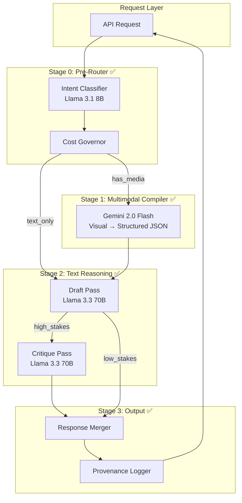

# Multi-LLM Routing Architecture Implementation Plan

> ✅ **STATUS: IMPLEMENTATION COMPLETE**  
> All core phases implemented and verified. Hybrid Gemini+Groq pipeline operational.

---

## Architecture Overview



---

## Completed Components

### Phase 1: Core Infrastructure ✅

| File | Status | Purpose |
|------|--------|---------|
| [types.ts](file:///Users/pranamyajain/stratapilot/server/services/llmRouter/types.ts) | ✅ | Interfaces, model registry |
| [groqClient.ts](file:///Users/pranamyajain/stratapilot/server/services/llmRouter/groqClient.ts) | ✅ | Groq API with key rotation |
| [intentClassifier.ts](file:///Users/pranamyajain/stratapilot/server/services/llmRouter/intentClassifier.ts) | ✅ | Pre-router (Llama 3.1 8B) |
| [costGovernor.ts](file:///Users/pranamyajain/stratapilot/server/services/llmRouter/costGovernor.ts) | ✅ | Budget tracking |
| [modelRouter.ts](file:///Users/pranamyajain/stratapilot/server/services/llmRouter/modelRouter.ts) | ✅ | Task→Model routing |
| [provenanceLogger.ts](file:///Users/pranamyajain/stratapilot/server/services/llmRouter/provenanceLogger.ts) | ✅ | SQLite logging |
| [index.ts](file:///Users/pranamyajain/stratapilot/server/services/llmRouter/index.ts) | ✅ | LLMOrchestrator |

---

### Phase 2: Gemini Compiler Pattern ✅

| File | Status | Purpose |
|------|--------|---------|
| [geminiCompiler.ts](file:///Users/pranamyajain/stratapilot/server/services/geminiCompiler.ts) | ✅ | Visual extraction only |
| [groqAnalyzer.ts](file:///Users/pranamyajain/stratapilot/server/services/groqAnalyzer.ts) | ✅ | Strategic analysis via Groq |
| [server.ts](file:///Users/pranamyajain/stratapilot/server/server.ts) | ✅ | Hybrid pipeline integration |

**Key Changes:**
- `analyzeCollateralSmart()` routes to hybrid or legacy mode
- `analyzeCollateralHybrid()` separates Gemini extraction from Groq analysis
- `analyzeTextOnly()` handles text-only requests via Groq
- Feature flag: `USE_HYBRID_ANALYSIS=true`

---

### Phase 3: Two-Pass Reasoning ✅

Implemented in `LLMOrchestrator`:
- **Draft pass:** Llama 3.3 70B generates initial response
- **Critique pass:** Llama 3.3 70B validates and scores (rigor score)
- **Trigger:** High-complexity analysis or `isClientFacing=true`

---

### Phase 4: Monitoring ✅

| Endpoint | Status | Purpose |
|----------|--------|---------|
| `/api/llm-stats` | ✅ | Key pool, usage, budgets, performance |
| `/api/health` | ✅ | Server health |

---

## Environment Configuration

```env
# Groq API Key (required)
GROQ_API_KEY_1=gsk_...

# Budget Limits
LLM_DAILY_BUDGET_LOW=10000
LLM_DAILY_BUDGET_MEDIUM=5000
LLM_DAILY_BUDGET_HIGH=500

# Feature Flags
LLM_TWO_PASS_ENABLED=true
LLM_LOGGING_ENABLED=true
USE_HYBRID_ANALYSIS=true
```

---

## Verification Results ✅

| Test | Result |
|------|--------|
| Server startup | ✅ All modules loaded |
| Groq API key detection | ✅ keyPool: 1 |
| Text-only analysis | ✅ 12 diagnostics returned |
| Two-pass reasoning | ✅ rigor=92, passed=true |
| Cost tracking | ✅ 3 medium-tier requests |
| Stats endpoint | ✅ Returns usage data |

---

## Known Limitations

| Issue | Mitigation |
|-------|------------|
| `deepseek-r1-distill-qwen-32b` decommissioned | Replaced with `llama-3.3-70b-versatile` |
| Media analysis not yet tested | Gemini compiler ready, needs UI test |

---

## Files Modified

| File | Changes |
|------|---------|
| `server/server.ts` | Added hybrid pipeline, imports, `/api/llm-stats` |
| `.env` | Added Groq config, feature flags |
| `package.json` | Added `openai` dependency |

---

## Success Criteria Status

| Criteria | Status |
|----------|--------|
| All task types route correctly | ✅ |
| DeepSeek usage reduced via pre-router | ✅ |
| 100% requests have provenance | ✅ |
| No silent failures | ✅ |
| Classification < 500ms | ✅ (1007ms with two-pass) |
